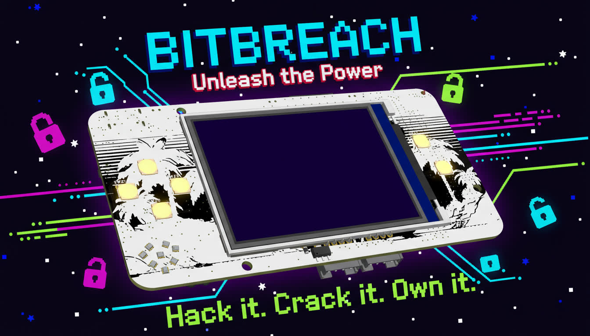
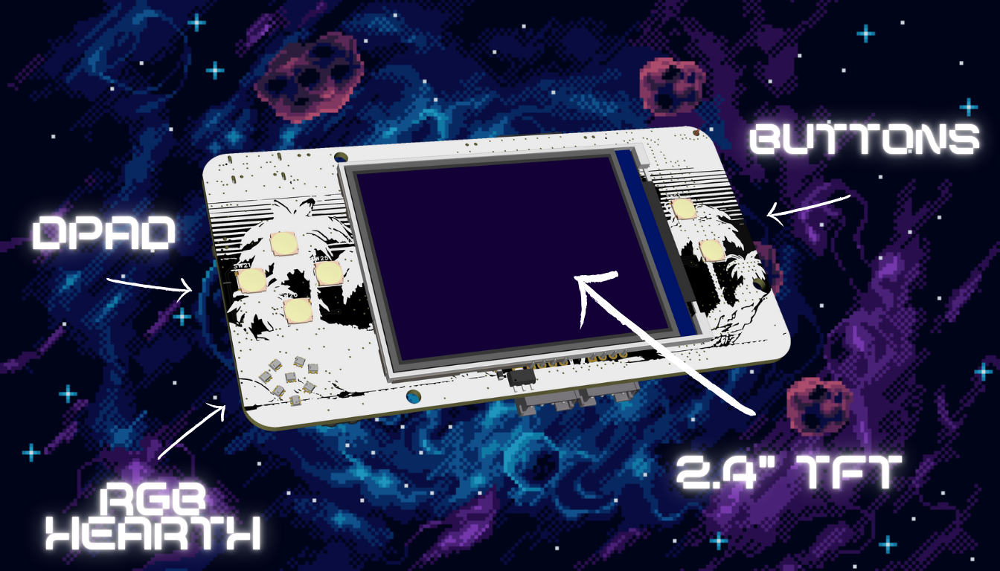
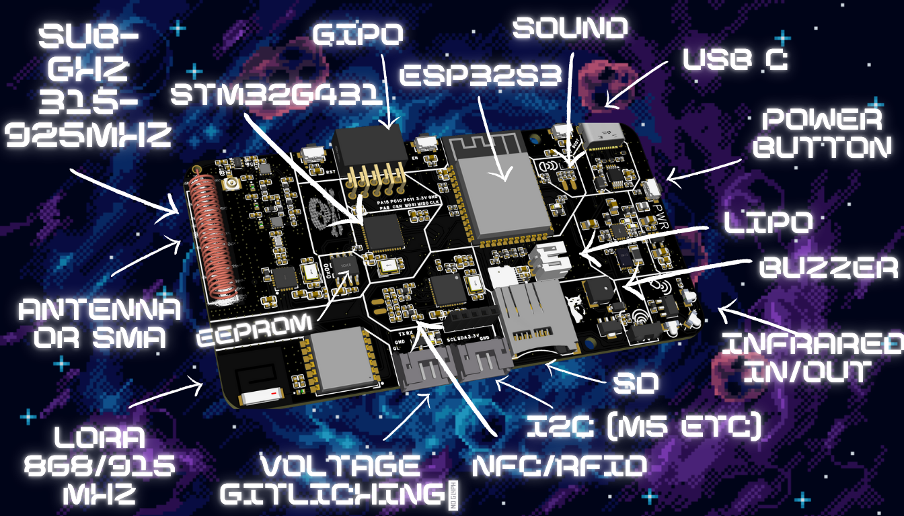
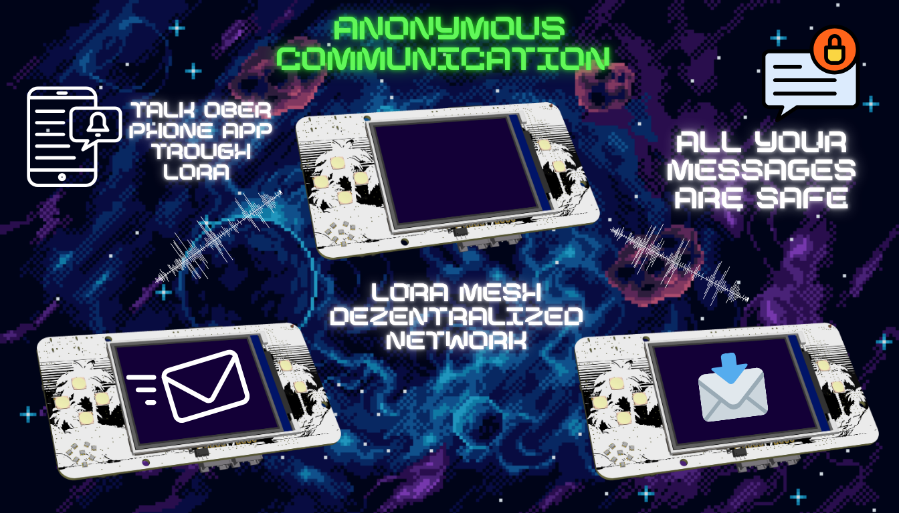

# BitBreach (Paused)

**Hack it. Crack it. Own it.**

A pocket-sized hacking and gaming device. Built by a 16-year-old who got tired of locked-down and expensive hardware.

Hackaday for Projekt Updates ---> https://hackaday.io/project/204325-bitbreach-open-source-pentesting-multitool

---

---

**Internals**

## What is this?

BitBreach is a handheld multitool for security research, RF hacking, and retro gaming. It's powered by an ESP32-S3 and STM32G4, with support for Sub-GHz RF, LoRa mesh, NFC, WiFi, BLE, voltage glitching, and more.

No cloud. No subscriptions. No locked firmware. You own it.

**Size:** 100mm × 50mm × ~20mm (fits in your pocket)

---

## Hardware

- **Main CPU:** ESP32-S3 (WiFi, BLE, AI-capable)
- **Secondary CPU:** STM32G4 (for glitching and peripherals)
- **Display:** 2.4" TFT (240×320)
- **Audio:** Built-in speaker
- **RF:** CC1101 Sub-GHz (3-band matching network: 315/433/868 MHz)
- **LoRa:** LLCC68 at 868 MHz (long-range mesh networking)
- **NFC:** PN7150 (read/write/emulate)
- **IR:** TX/RX for remote control replay
- **Storage:** microSD + onboard flash
- **Power:** LiPo battery, USB-C charging
- **I/O:** GPIO header, IPEX antenna connector
- **Case:** 3D-printable and injection-molded (clear resin planned)

---

## What can it do?

### RF & Radio
- **Sub-GHz:** Replay attacks, signal analysis (CC1101 with 3 switchable bands)
- **LoRa Mesh:** Anonymous communication over decentralized LoRa networks. Connect with other BitBreach devices or public LoRa infrastructure worldwide for off-grid messaging
- **WiFi/BLE:** Packet sniffing, deauth attacks, BLE scanning
- **NFC:** Clone cards, read/write tags, emulate credentials
- **IR:** Universal remote, brute-force IR codes

### Security
- **Voltage Glitching:** Fault injection for firmware extraction and bypass testing
- **EEPROM Challenges:** Unlock features by hacking your own device

### Gaming & Apps
- **Retro Emulation:** (RetroGo) ported to Bitbreach
- **Custom Apps:** SDK in development for community-built tools
- **Digital Pet:** Tamagotchi-style pet (because why not)

### AI Features
- Signal analysis using onboard AI (ESP32-S3)
- Pattern recognition for RF and protocol analysis

---

## Why BitBreach?

Most hacking tools are either expensive, locked down, or missing key features. BitBreach combines everything into one device:

| Feature           | BitBreach       | Flipper Zero | Others |
|-------------------|-----------------|--------------|--------|
| WiFi/BLE          | ✅ ESP32-S3      | ❌            | Varies |
| Sub-GHz RF        | ✅ CC1101 (3-band)| ✅ CC1101     | ✅      |
| LoRa Mesh         | ✅ LLCC68        | ❌            | ❌      |
| Voltage Glitching | ✅ STM32G4       | ❌            | ❌      |
| NFC               | ✅ PN7150        | ✅ Basic      | Varies |
| Retro Gaming      | ✅ Full emulation| ❌            | ❌      |
| Open Source       | ✅ Post-Kickstarter| Partial   | Varies |
| Size              | 100×50×17mm     | Larger       | Varies |

---

## LoRa Anonymous Mesh

BitBreach supports **LoRa mesh networking** for anonymous, off-grid communication:

- **Long-range:** Up to 10km in cities, 40km+ in rural areas
- **Decentralized:** No servers, no tracking
- **Anonymous:** Messages route through mesh nodes with no sender identification
- **Global network:** Connect to public LoRa infrastructure or create your own mesh
- **Use cases:** Protests, off-grid comms, emergency networks, privacy-focused messaging

Perfect for situations where internet and cell networks aren't an option—or when you don't want anyone watching.

---

## Status

- ✅ Prototype working
- 🔄 Dev testing in progress
- 🔜 Kickstarter launch soon
- 🔜 Injection-molded case finalized
- 🔜 SDK and app platform under development
- ✅ Full open-source release after Kickstarter

---

## Who made this?

I'm 16, from Germany. I taught myself electronics, firmware, and hardware design. BitBreach started as a personal project and grew into something bigger.

Some parts of this README were cleaned up with AI tools for readability, but all technical decisions and design work are mine.

---

**Remember Blackberry or miss anonymity?**

---

## Sponsors

Looking for hardware partners to make this real. If you're from **JLCPCB**, **Espressif**, **NXP**, **Seeed**, **M5Stack**, **Hack5**, **Waveshare**, **LilyGo**, **Pine64**, or any similar company, let's talk.

Influencers welcome too.

**Big thanks to [JLCPCB](https://jlcpcb.com)** for sponsoring early prototypes.

---

## Want to help?

- ⭐ Star this repo
- 🔗 Share it
- 💬 Join the forum (coming soon)
- 🔧 Fork it, break it, mod it

---

**BitBreach – small device, big impact.**
